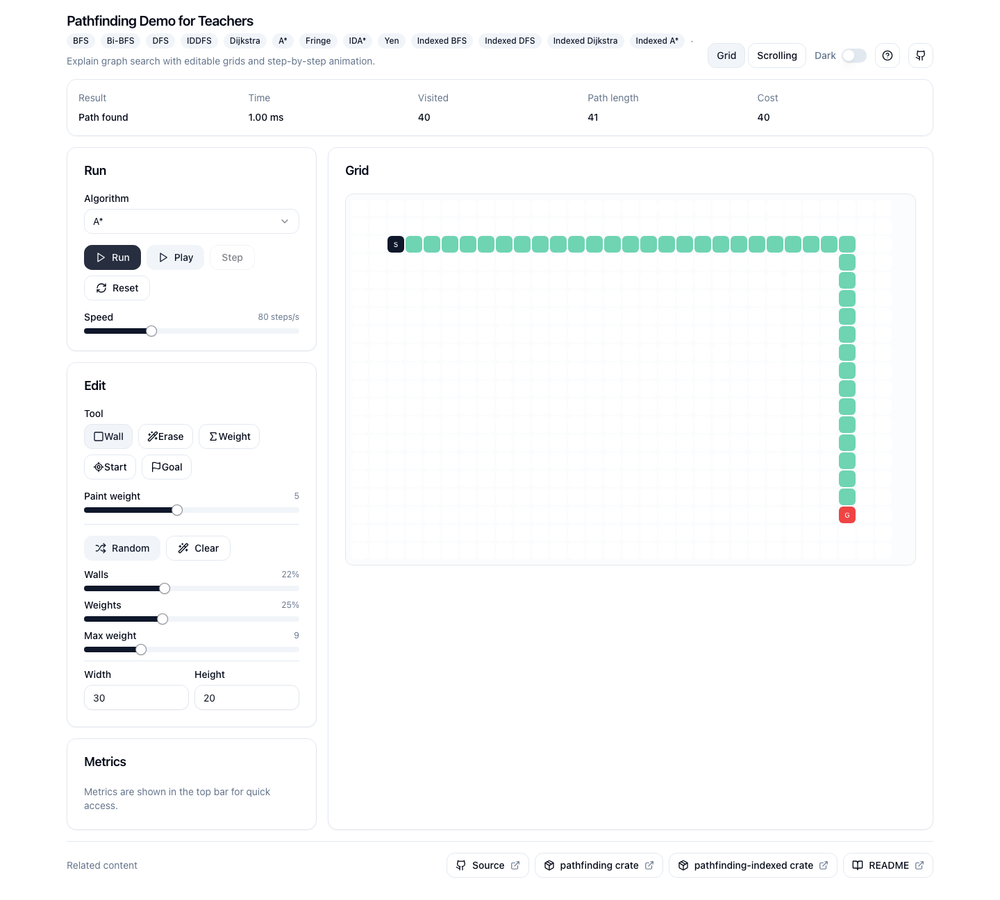

# Pathfinding, made visible

I built this demo because I wanted to watch search algorithms make decisions instead of learning
them from another static diagram. The editable grid exposes the order in which each algorithm
explores, the path it ultimately chooses, and the cost of that choice.

**[Try the live demo](https://pathfinding-client.vercel.app/)**



The demo supports a static grid for step-by-step exploration and a continuously scrolling,
multi-exit mode for comparing repeated replanning strategies. Its Rust engine compiles to
WebAssembly; the React interface handles editing, playback, and metrics.

## Crates and attribution

This repository is the visualization client. It uses two related Rust crates:

- [`pathfinding`](https://github.com/evenfurther/pathfinding) is the original general-purpose
  library by **Samuel Tardieu and its contributors**. The algorithms and coverage from which the
  indexed work descends are theirs.
- [`pathfinding-indexed`](https://github.com/Zacaria/pathfinding-indexed) is my separate,
  index-specialized derivative. It narrows the model to dense `usize` node indices and graph-owned
  methods; it is not the original `pathfinding` library. See its
  [published documentation](https://docs.rs/pathfinding-indexed/latest/pathfinding_indexed/) for the
  API and its own attribution.

Both crates are loaded as published dependencies by `crates/engine`. The frontend does not present
the original `pathfinding` library as my work.

## Project structure

- `crates/engine` — Rust/WASM adapters and trace generation
- `web` — React, Vite, shadcn/ui, Vitest, and Playwright
- `openspec` — archived feature decisions and requirements
- `docs/demo.mp4` — short interaction recording

## Run locally

### Prerequisites

- A stable Rust toolchain with the `wasm32-unknown-unknown` target
- [`wasm-pack`](https://github.com/drager/wasm-pack/releases)
- Node.js 22 and npm

```bash
rustup target add wasm32-unknown-unknown
cd web
npm ci
npm run build:wasm
npm run dev
```

Vite prints the local URL. The committed WebAssembly declaration is supplemented by generated
JavaScript and `.wasm` files during `npm run build:wasm`.

## Verify

```bash
cargo fmt --all -- --check
cargo clippy --workspace --all-targets -- -D warnings
cargo test --workspace

cd web
npm ci
npm run build:wasm
npm test
npm run lint
npx playwright install chromium
npm run test:e2e
npm run build
```

GitHub Actions runs the Rust, frontend, WASM, and critical browser checks from a clean checkout.

## Deployment

`vercel.json` and `scripts/vercel-build.sh` install the Rust/WASM prerequisites, compile the engine,
and build the Vite frontend for Vercel. The public deployment is
<https://pathfinding-client.vercel.app/>.

## License

The visualization client is available under the [MIT License](LICENSE). Third-party dependencies,
including `pathfinding` and `pathfinding-indexed`, retain their own licenses and copyright notices.
