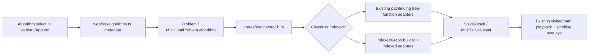

# feat: Add indexed pathfinding algorithms

## Overview

Add `pathfinding_indexed`-backed algorithm variants to the Rust WASM engine and expose them in the React control panel as a separate selector section. The work keeps the current `solve` / `solve_multi` contract intact so the existing grid playback, scrolling mode, metrics cards, and error handling continue to work while letting users compare classic closure-based algorithms against dense-indexed graph variants on the same grid.

## Problem Frame

The current demo only exposes algorithms implemented through the `pathfinding` crate’s generic free-function API in `crates/engine/src/lib.rs`. That works, but this demo already models the grid as dense `usize` indices internally (`to_idx` / `from_idx`), which makes it a natural fit for `pathfinding_indexed`. The requested change is not just a dependency swap: users need both families available side-by-side, and the selector must make that distinction explicit without breaking the current grid and scrolling flows.

The existing OpenSpec artifacts establish two constraints that still apply here:
- the engine should continue returning deterministic traces and metrics suitable for visualization (`openspec/changes/add-react-shadcn-pathfinding-demo/design.md`)
- the same `algorithm` state drives both normal grid runs and scrolling multi-exit recomputation (`web/src/App.tsx`), so selector changes affect both modes

## Requirements Trace

- R1. Add indexed algorithm variants that operate on the current grid model without changing the public WASM entrypoints or result payload shapes.
- R2. Preserve the current visualization contract: runs still return `visited`, `path`, `found`, `path_cost`, and timing data for both single-goal and scrolling multi-goal modes.
- R3. Expose indexed variants in the UI under a distinct algorithm-selector section so users can intentionally choose between classic and indexed families.
- R4. Keep existing classic algorithms available and behaviorally unchanged.
- R5. Add automated coverage for engine behavior and selector/catalog behavior so Rust and TypeScript stay aligned as algorithm options grow.
- R6. Update local build/documentation touchpoints that are affected by the new Rust dependency and regenerated WASM output.

## Scope Boundaries

- No redesign of the playback model, metrics cards, or grid-editing tools.
- No new problem modes beyond the existing `grid` and `scrolling` flows.
- No benchmark UI, perf dashboard, or runtime algorithm auto-selection.
- No expansion into graph APIs outside the currently supported pathfinding demos.

### Deferred to Separate Tasks

- Performance benchmarking between classic and indexed families beyond the existing timing cards.
- Any future migration that would remove classic algorithms entirely.

## Context & Research

### Relevant Code and Patterns

- `crates/engine/src/lib.rs` contains the full Rust-side contract: the serde `Algorithm` enum, `Problem` / `MultiGoalProblem` payloads, single-goal `solve_problem`, scrolling `solve_multi_problem`, and the current guardrails for expensive algorithms.
- `web/src/types.ts` mirrors the Rust enum as a TypeScript string union that is consumed by both `web/src/App.tsx` and `web/src/wasm/engine.d.ts`.
- `web/src/App.tsx` currently hard-codes algorithm options, badges, hint copy, and Yen-specific controls directly inside the component. The same `algorithm` state is fed into both `runSolve()` and `scrollingTick()`.
- `openspec/changes/add-react-shadcn-pathfinding-demo/design.md` establishes the existing pattern of precomputing the trace in Rust and animating it later in React, which this change should preserve.

### Institutional Learnings

- `knowledge/browser-feedback-loop.md` documents that stale `web/src/wasm/*` output is a common failure mode. Any plan that changes engine-side algorithm types should preserve the JS/WASM boundary and explicitly verify rebuilt WASM artifacts before declaring the work done.

### External References

- [`pathfinding_indexed` crate docs](https://docs.rs/pathfinding-indexed/latest/pathfinding_indexed/) describe the indexed API as dense-`usize` graph algorithms exposed as methods on `IndexedGraph` / `IndexedUndirectedGraph`, which matches this repo’s internal grid indexing model.
- [`pathfinding_indexed` crate page](https://docs.rs/crate/pathfinding-indexed/4.15.0) documents the separate indexed crate positioning and notes an MSRV of Rust 1.87.0.
- [`pathfinding` crate docs](https://docs.rs/pathfinding/) document the current closure-based directed algorithms and the broader generic API this demo already uses.

## Key Technical Decisions

- Keep the public WASM API shape unchanged.
  Rationale: `web/src/engine.ts`, `web/src/types.ts`, and the generated `web/src/wasm/engine.d.ts` already expect `solve`, `solve_multi`, and `generate_random` to keep their payload contracts stable. Adding indexed support as new `Algorithm` variants avoids a broader integration churn.

- Model indexed variants as additional enum values rather than replacing the current ones.
  Rationale: the user explicitly asked for a separate selector section. Separate variants preserve side-by-side comparison and keep classic behavior intact.

- Use `IndexedGraph` over `IndexedGraphMap`.
  Rationale: the engine already normalizes points to dense `usize` indices. Introducing an external-node mapping layer would add indirection without solving a real problem in this repo.

- Centralize indexed graph construction behind reusable engine helpers.
  Rationale: both `solve_problem` and `solve_multi_problem` need the same grid-to-graph translation, and the current file already duplicates weighted vs unweighted successor logic. A shared adapter layer reduces the risk of classic/indexed drift.

- Refactor the frontend selector to be metadata-driven.
  Rationale: algorithm labels, family grouping, Yen support, weight warnings, and “slow algorithm” hints are currently spread across hard-coded JSX conditionals. A catalog module will let the selector render grouped sections while keeping hint logic and badges in sync.

- Keep scrolling mode on the same `algorithm` state and same engine endpoints.
  Rationale: `web/src/App.tsx` already treats algorithm choice as a cross-mode concern. Splitting UI state by mode would introduce unnecessary divergence and make comparisons harder.

## Open Questions

### Resolved During Planning

- Should indexed algorithms replace the current classic algorithms?
  Resolution: No. Keep both families available and visually separated in the selector.

- Should the grouped selector apply only to grid mode?
  Resolution: No. The same grouped catalog should drive both `runSolve()` and `scrollingTick()` because the current app already shares a single `algorithm` state across modes.

- Should the engine introduce separate indexed-only WASM functions?
  Resolution: No. Keep the existing entrypoints and dispatch internally by algorithm variant.

### Deferred to Implementation

- Exact indexed variant coverage.
  Why deferred: implementation should confirm which `pathfinding_indexed` methods cleanly map onto the repo’s currently exposed set before finalizing names and UI copy.

- Trace-order parity for every indexed algorithm.
  Why deferred: implementation needs to confirm whether each indexed method exposes enough traversal detail to match the current “visited” animation semantics exactly, or whether some indexed variants need documented differences.

## High-Level Technical Design

> *This illustrates the intended approach and is directional guidance for review, not implementation specification. The implementing agent should treat it as context, not code to reproduce.*

## Implementation Units

- [x] **Unit 1: Add engine-side indexed algorithm modeling**

**Goal:** Introduce the new Rust dependency, extend the shared algorithm model, and create reusable grid-to-indexed-graph helpers that both solve paths can call.

**Requirements:** R1, R4, R6

**Dependencies:** None

**Files:**
- Modify: `Cargo.toml`
- Modify: `crates/engine/Cargo.toml`
- Modify: `crates/engine/src/lib.rs`
- Create: `crates/engine/src/indexed.rs`
- Test: `crates/engine/tests/indexed_graph_build.rs`

**Approach:**
- Add `pathfinding-indexed` to the workspace and engine crate dependencies, aligning versions intentionally rather than pulling in an unrelated lockfile bump.
- Extend the Rust `Algorithm` enum with explicit indexed variants instead of overloading existing names.
- Move indexed-specific graph construction into a dedicated engine module that can build deterministic weighted and unweighted adjacency from the existing `cells` array and `to_idx` indexing.
- Keep validation and point/index conversion in the main engine path so classic and indexed flows continue to share the same boundary checks.

**Patterns to follow:**
- `crates/engine/src/lib.rs` validation and `to_idx` / `from_idx` helpers
- Existing split between weighted and unweighted traversal helpers in `crates/engine/src/lib.rs`

**Test scenarios:**
- Happy path: building an unweighted indexed graph from a small wall-free grid yields adjacency that matches the four-neighbor layout.
- Happy path: building a weighted indexed graph preserves destination cell weights as edge costs.
- Edge case: wall cells are excluded from outgoing adjacency and cannot be reached through generated edges.
- Edge case: start and goal on valid non-wall cells still map to the same stable `usize` indices as the classic path.
- Error path: invalid grid shapes (mismatched cell count, out-of-bounds points) continue to fail through the existing validation path rather than producing a malformed indexed graph.

**Verification:**
- The engine can construct indexed graph inputs from the current grid model without changing the `Problem` / `MultiGoalProblem` serde shape.

- [x] **Unit 2: Dispatch indexed algorithms through solve and scrolling flows**

**Goal:** Make indexed variants runnable through `solve` and `solve_multi` while preserving the current result payload contract and guardrails.

**Requirements:** R1, R2, R4, R5

**Dependencies:** Unit 1

**Files:**
- Modify: `crates/engine/src/lib.rs`
- Modify: `crates/engine/src/indexed.rs`
- Test: `crates/engine/tests/indexed_algorithms.rs`

**Approach:**
- Add indexed branches to the single-goal and multi-goal dispatch paths rather than creating a second solve pipeline.
- Reuse the existing guardrail pattern for algorithms that can block the UI, and explicitly decide whether indexed variants inherit or adjust those thresholds.
- Keep `SolveResult` and `MultiSolveResult` field shapes identical so React playback code does not need separate rendering branches.
- Use the indexed adapter layer to translate algorithm outputs back into `Point` traces and cost fields, preserving comparability with classic runs.

**Execution note:** Start with failing Rust tests that prove at least one indexed weighted algorithm and one indexed unweighted algorithm return sane path/cost/visited payloads before wiring the full selector surface.

**Patterns to follow:**
- Existing `solve_problem()` / `solve_multi_problem()` match-based dispatch in `crates/engine/src/lib.rs`
- Existing Dijkstra special-casing for scrolling multi-goal behavior

**Test scenarios:**
- Happy path: an indexed weighted algorithm finds the same shortest-path cost as the classic weighted counterpart on a simple weighted grid.
- Happy path: an indexed unweighted algorithm returns a valid path from start to goal on a simple unweighted grid.
- Happy path: scrolling mode with an indexed all-target-capable algorithm returns a reachable best exit and stable `best_goal_index`.
- Edge case: start equals goal returns an immediate path/cost result without panicking.
- Edge case: unreachable goal returns `found = false`, empty path, and `path_cost = null`.
- Error path: the same large-grid guardrails that currently reject slow algorithms still surface a user-facing engine error for indexed variants when the chosen variant is capped.
- Integration: grid `solve()` and scrolling `solve_multi()` both serialize indexed variants through serde and back to JS without changing result field names.
- Integration: classic algorithms still return the same results after the indexed branches are introduced.

**Verification:**
- Indexed variants can be executed through the existing WASM entrypoints, and classic variants still pass unchanged behavior checks.

- [x] **Unit 3: Create a shared frontend algorithm catalog**

**Goal:** Replace hard-coded algorithm strings and hint branches with metadata that can render grouped selector sections and keep frontend behavior aligned with the Rust enum.

**Requirements:** R3, R4, R5

**Dependencies:** Unit 2

**Files:**
- Modify: `web/src/types.ts`
- Create: `web/src/algorithms.ts`
- Modify: `web/package.json`
- Create: `web/vitest.config.ts`
- Create: `web/src/algorithms.test.ts`

**Approach:**
- Expand the TypeScript `Algorithm` union to include the indexed variants introduced in Rust.
- Move labels, family grouping, weight-awareness, Yen support, and “slow algorithm” hints into a catalog module so `App.tsx` can render from data rather than from repeated string comparisons.
- Add a lightweight frontend test harness only as far as needed to assert catalog integrity and prevent Rust/TS drift from silently breaking the selector surface.
- Keep the generated WASM typing boundary valid by relying on the shared TypeScript payload types rather than introducing a second frontend-only algorithm source of truth.

**Patterns to follow:**
- Existing `web/src/types.ts` union and payload types
- Current Radix `Select` usage in `web/src/App.tsx`

**Test scenarios:**
- Happy path: the shared catalog exposes both “Classic” and “Indexed” groups with stable labels for each selectable variant.
- Happy path: Yen-capable entries remain marked so the UI can still show the `k` control only where supported.
- Edge case: every catalog entry maps to a valid `Algorithm` union value and no duplicate values exist across groups.
- Edge case: weighted/unweighted metadata correctly distinguishes algorithms that ignore weights from those that honor them.
- Integration: the TypeScript union accepted by `Problem` and `MultiGoalProblem` matches the selectable values exported by the catalog.

**Verification:**
- Frontend selector rendering can be driven from a single metadata source without stringly-typed branches scattered through the component.

- [x] **Unit 4: Update the React selector and documentation touchpoints**

**Goal:** Render the new grouped selector in the existing control panel, keep grid and scrolling behavior intact, and update docs/build notes that are affected by the new dependency and rebuild requirements.

**Requirements:** R2, R3, R4, R6

**Dependencies:** Unit 3

**Files:**
- Modify: `web/src/App.tsx`
- Modify: `README.md`
- Modify: `web/README.md`
- Test: `web/src/App.test.tsx`

**Approach:**
- Replace the flat algorithm option list with grouped sections labeled for classic vs indexed variants.
- Drive badges, warning copy, and Yen-specific controls from the shared catalog metadata so new variants do not require scattered conditionals.
- Ensure both `runSolve()` and `scrollingTick()` continue to pass the selected algorithm value unchanged into the existing engine entrypoints.
- Update documentation where the new dependency or required WASM rebuild steps matter, especially because stale generated WASM files are a known failure mode in this repo.

**Execution note:** Add characterization coverage around selector rendering and conditional hint behavior before simplifying the JSX branches in `web/src/App.tsx`.

**Patterns to follow:**
- Existing Radix Select layout in `web/src/App.tsx`
- Existing error messaging around missing WASM output in `web/src/App.tsx`
- Current build and setup notes in `README.md` and `web/README.md`

**Test scenarios:**
- Happy path: the algorithm selector renders separate “Classic” and “Indexed” sections and allows choosing an indexed variant.
- Happy path: selecting an indexed variant is honored by both the grid run button and scrolling mode tick loop.
- Edge case: Yen-specific `k` controls appear only for Yen variants and disappear when switching away.
- Edge case: weight-warning copy appears only for algorithms that ignore weights, regardless of family.
- Edge case: slow-algorithm warning copy still appears for capped variants after the selector refactor.
- Integration: the default selected value remains valid on first render and the control does not crash if the app toggles between `grid` and `scrolling`.

**Verification:**
- Users can distinguish and run classic vs indexed algorithms from the same control panel, and the rest of the UI behaves exactly as before.

## System-Wide Impact

- **Interaction graph:** `algorithm` is shared state across grid runs, scrolling recomputation, metrics display, badges, and hint copy. Any enum/catalog drift will break multiple surfaces at once.
- **Error propagation:** engine-side validation and guardrail failures continue to surface as string errors caught by `runSolve()` and `scrollingTick()` in `web/src/App.tsx`.
- **State lifecycle risks:** changing algorithm metadata affects both the initial render and live scrolling mode, where the interval hook depends on `algorithm`, `yenK`, and grid settings.
- **API surface parity:** Rust serde enum values, TypeScript union values, selector catalog entries, and generated WASM typings must remain synchronized.
- **Integration coverage:** verification needs to cover both `solve()` and `solve_multi()` with at least one indexed variant, because the scrolling path has extra Dijkstra-specific branching and exit aggregation.
- **Unchanged invariants:** `Problem`, `MultiGoalProblem`, `SolveResult`, `MultiSolveResult`, grid editing tools, playback state, and current classic algorithm behavior should remain intact.

## Risks & Dependencies

| Risk | Mitigation |
|------|------------|
| `pathfinding-indexed` has a newer MSRV than the current `pathfinding` crate docs used here | Verify local and CI/Vercel Rust toolchains before locking the dependency choice; keep the version bump explicit and documented |
| Indexed methods may not expose traversal order identical to the current closure-instrumented approach | Define deterministic trace expectations in tests and document any algorithm-specific visualization differences rather than silently changing semantics |
| Rust enum values and frontend selector options can drift | Centralize frontend catalog metadata and add tests that assert catalog values match the accepted `Algorithm` union |
| Scrolling-mode guardrails may need different thresholds for indexed variants | Reuse existing caps initially, then adjust only if integration tests or smoke validation show UI blocking |

## Documentation / Operational Notes

- Rebuild the WASM bundle after the Rust dependency and enum changes so `web/src/wasm/*` stays aligned with the Rust engine.
- Keep README setup instructions accurate if dependency or rebuild expectations change.
- Manual smoke verification should include one classic and one indexed run in both `grid` and `scrolling` modes because the generated WASM boundary is a known operational footgun in this repo.

## Sources & References

- Related design: `openspec/changes/add-react-shadcn-pathfinding-demo/design.md`
- Related tasks: `openspec/changes/add-react-shadcn-pathfinding-demo/tasks.md`
- Current engine surface: `crates/engine/src/lib.rs`
- Current frontend selector surface: `web/src/App.tsx`
- Current type boundary: `web/src/types.ts`
- Known WASM rebuild pitfall: `knowledge/browser-feedback-loop.md`
- External docs: [`pathfinding_indexed`](https://docs.rs/pathfinding-indexed/latest/pathfinding_indexed/), [`pathfinding_indexed` crate page](https://docs.rs/crate/pathfinding-indexed/4.15.0), [`pathfinding`](https://docs.rs/pathfinding/)
